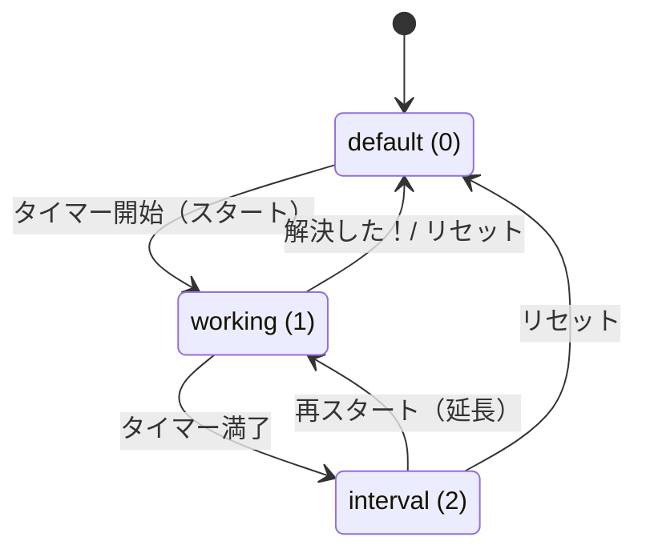

# はまったいまー仕様書

本書は「はまったいまー」（URL: https://hamattimer.app/ ）の機能仕様をまとめたものです。
画面・機能・ユーザー操作・データの流れを中心に記述します。技術詳細は要点のみを扱います。

---

## 1. 概要

### 1.1 アプリの目的・コンセプト

「はまったいまー」は、**ハマった時に時間を浪費してしまう問題を解決したいプログラミング学習者**のための、
**タイマー付きメモアプリ**です。

- **タイマー機能**で問題解決に使う時間に区切りを作り、詰まった時に「人に質問する」など次の手を打ちやすくする。
- **メモ機能**で「何を考えて・何をやったのか」を入力フォームに沿って記録し、思考を整理・客観視できるようにする。
- 入力中のメモは画面右側に**リアルタイムでMarkdownプレビュー**される。
- 作成した記録は **GitHub Gist への保存** または **クリップボードへのコピー** でエクスポートできる。

### 1.2 対象ユーザー

プログラミング学習者（エラー対応・デバッグで時間を使いがちな初学者を主な想定）。

### 1.3 提供形態・特徴

- ログイン不要で利用開始できる（Gist保存時のみ GitHub 認証が必要）。
- **サーバーDBを持たない**。入力内容はブラウザの `localStorage` に保存され、同一ブラウザ内でのみ復元される。
- 永続的な保管は GitHub Gist へのエクスポートによって行う設計。

---

## 2. 用語・ドメインモデル

| 用語 | 説明 |
|------|------|
| **Issue（解決したいこと）** | 1セッションにつき1件。`tobe`（期待する結果）/ `asis`（実際の結果）/ `problem`（詳しい状況）の3項目で構成。 |
| **Trial（試したこと）** | 試行錯誤の記録。`guess`（考えたこと・調べたこと）/ `operation`（やったこと）/ `result`（やった結果）の3項目で構成。 |
| **Timer** | 設定時間からのカウントダウン。満了するとモーダルで通知。 |
| **Markdown** | Issue と Trial から自動生成される記録テキスト。プレビュー表示・エクスポートに使用。 |
| **Gist** | GitHub Gist。生成した Markdown の保存先。 |

ドメインの中核は **「Issue ＋ Trial」→ Markdown 生成 → プレビュー → エクスポート** という流れです。

---

## 3. 画面一覧

| パス | 画面 | 役割 | 実装 |
|------|------|------|------|
| `/` | ウェルカムページ | アプリ紹介・使い方ガイド・利用規約／プライバシーポリシー | [src/pages/index.jsx](src/pages/index.jsx) → [WelcomePage.jsx](src/components/templates/WelcomePage.jsx) |
| `/timer` | メインページ | タイマー＋メモ編集＋プレビュー＋エクスポート | [src/pages/timer.jsx](src/pages/timer.jsx) → [TimerPage.jsx](src/components/templates/TimerPage.jsx) |

### 画面遷移

- ウェルカムページの「使ってみる」ボタン（`ButtonLetsTryPosi` / `ButtonLetsTryNega`）から `/timer` へ遷移。
- メインページのフッター「トップページ」リンクから `/` へ戻る。

### メインページのレイアウト

[TimerPage.jsx](src/components/templates/TimerPage.jsx) は次の構成です。

- 上部: **ナビバー**（[Navbar.jsx](src/components/organizations/Navbar.jsx)） — ロゴ、タイマー、「解決した！」「リセット」ボタン
- 直下: **開始前の案内通知**（[NotificationStart.jsx](src/components/molecules/NotificationStart.jsx)）
- 本文（2カラム）:
  - 左 = **エディタ**（[Editor.jsx](src/components/organizations/Editor.jsx)） — Issue ＋ Trials
  - 右 = **プレビュー**（[Preview.jsx](src/components/organizations/Preview.jsx)） — Markdown プレビュー ＋ コピー／Gist保存ボタン
- 下部: **フッター** — トップページ／利用規約／プライバシーポリシー／GitHub連携解除

---

## 4. 機能仕様

各機能について「目的／操作／挙動／関連コンポーネント」を記述します。

### 4.1 タイマー

実装: [CountdownTimer.jsx](src/components/organisms/CountdownTimer.jsx)、[Navbar.jsx](src/components/organizations/Navbar.jsx)

- **目的**: 問題解決に使う時間を区切り、満了時に次の手を促す。
- **時間選択**: `15 / 25 / 30 / 45 / 60` 分から選択（デフォルト **30分**）。[SelectLimit.jsx](src/components/molecules/SelectLimit.jsx)
- **開始（スタート）**:
  - `default` 状態のとき、画面中央に「今から取り組む問題に、どれくらいの時間を使う予定ですか？」というモーダル（`ModalPlain`）を表示し、時間選択＋スタートを促す。
  - スタートで状態が `working` になり、選択時間からカウントダウンを開始。開始時刻を `started_at` に保存。
  - 実装: [ButtonTimerStart.jsx](src/components/molecules/ButtonTimerStart.jsx)
- **カウンタ表示**: `H:MM SS` 形式で表示。残り時間は常時 `timer` に保存され、リロード後も復元される。[Counter.jsx](src/components/molecules/Counter.jsx)
- **一時停止／再開**: 実行中は一時停止、停止中は再開を切り替えられる。[ButtonTimerControl.jsx](src/components/molecules/ButtonTimerControl.jsx)
- **満了時の通知（interval）**: 設定時間に達すると状態が `interval` になり、「**調子はどうですか？**」モーダルを表示。
  - 本文: 「`{設定分}分経ちました🔔` 詰まっていたら違った切り口で取り組んでみるのも良さそうです。」
  - 提案リスト: 「一旦やめて休憩する」「誰かに質問してみる」「別の実現方法はないか考えてみる」
  - 補足: 「延長したい場合は、タイマーを再セットしてください。」
- **延長**: 満了モーダルを閉じた後、時間を選び直して再スタートすることで延長する。

### 4.2 メモ入力

#### 4.2.1 解決したいこと（Issue）

実装: [Issue.jsx](src/components/organisms/Issue.jsx)

| 項目 | ラベル | 入力欄 | プレースホルダ |
|------|--------|--------|----------------|
| `tobe` | 期待する結果をひとことで | 1行入力 | `○○したら××が表示される` |
| `asis` | 実際の結果をひとことで | 1行入力 | `○○しても画面の表示が変わらない` |
| `problem` | 詳しい状況 | 複数行（Markdown／画像ペースト対応） | `エラーメッセージ、ログ、経緯など` |

- 入力（`onChange`）のたびに `issue` を `localStorage` に保存し、Markdown を再生成。

#### 4.2.2 試したこと（Trial）

実装: [Trials.jsx](src/components/organisms/Trials.jsx)、[Trial.jsx](src/components/organisms/Trial.jsx)

| 項目 | ラベル | 入力欄 | プレースホルダ |
|------|--------|--------|----------------|
| `guess` | 考えたこと・調べたこと | 複数行（Markdown対応） | `- □□が△△かもしれない` ほか |
| `operation` | やったこと | 複数行（Markdown対応） | `以下のコマンドを実行した` ＋ コードブロック例 |
| `result` | やった結果 | 複数行（Markdown対応） | `コマンドの実行結果のログ、スクリーンショットなど` |

- 入力のたびに `trials` を `localStorage` に保存し、Markdown を再生成。

### 4.3 リアルタイム Markdown プレビュー

実装: [Preview.jsx](src/components/organizations/Preview.jsx)、生成ロジック [MarkdownProvider.jsx](src/components/providers/MarkdownProvider.jsx)

- Issue・Trial の入力内容から Markdown を生成し、`react-markdown`（`remark-gfm` / `remark-breaks`）で右ペインに描画。
- 空欄の項目はプレビュー（および生成 Markdown）に出力されない。
- 生成フォーマットは [6.2 Markdown 生成フォーマット](#62-markdown-生成フォーマット) を参照。

### 4.4 画像ペースト（スクリーンショット）

実装: [MarkdownArea.jsx](src/components/molecules/MarkdownArea.jsx)、[api/upload.js](src/pages/api/upload.js)

- Markdown対応テキストエリア（`problem` / `guess` / `operation` / `result`）に画像を**ペースト**すると、画像のみを対象に処理する。
- 画像を Data URL 化して `/api/upload` 経由で **Cloudinary** にアップロードし、返ってきた URL を `` の Markdown 記法としてカーソル位置に自動挿入する。

### 4.5 エクスポート

プレビュー下部のボタン群（[Preview.jsx](src/components/organizations/Preview.jsx)）で行う。

- **クリップボードへコピー**: 生成済み Markdown をクリップボードにコピー。[ButtonCopy.jsx](src/components/molecules/ButtonCopy.jsx)
- **Gist に保存**: GitHub 認証のうえ Gist を作成し、作成された Gist を新規タブで開く。[ButtonGist.jsx](src/components/molecules/ButtonGist.jsx)
  - **未認証時**: ボタン押下で GitHub 認証フロー（`signIn('github')`）へ。認証完了を検知すると自動的に Gist を作成する。
  - **認証済み時**: ボタン押下で即 Gist を作成。
  - **ファイル名**: `{tobe先頭20文字（記号除去）}_{started_at}.md`（`started_at` 未設定時は `開始前`）。

### 4.6 リセット／解決完了

- **解決した！**: タイマーを一時停止し、「**おつかれさまです🎉**」モーダル（祝福画像＋Gist保存の案内）を表示。[ButtonSolved.jsx](src/components/molecules/ButtonSolved.jsx)
- **リセット**: 確認モーダル「記録をリセットします（記録した内容を消して初期状態に戻しますか？）」のうえ、入力内容・Trial・タイマー・開始時刻をすべて初期化する。[ButtonReset.jsx](src/components/molecules/ButtonReset.jsx)
  - 初期化内容: フォームを `reset`、状態を `default` に、`issue` を空に、試したことの入力内容を空に、`timer` を 0 に、`started_at` を空文字に設定。

### 4.7 GitHub 認証・連携解除

- **認証**: NextAuth.js による GitHub OAuth。スコープは `gist`（Gist作成権限）。[api/auth/[...nextauth].js](src/pages/api/auth/%5B...nextauth%5D.js)
- **連携解除**: フッターのリンクから `signOut`。[LinkSignOut.jsx](src/components/molecules/LinkSignOut.jsx)
- 認証は Gist 保存のためにのみ必要。メモの入力・プレビュー・コピーは認証なしで利用できる。

### 4.8 ウェルカムページ

実装: [WelcomePage.jsx](src/components/templates/WelcomePage.jsx)

- **ヒーロー**: キャッチコピー「プログラミングでハマる前に／はまったいまー」とアプリ説明、「使ってみる」ボタン。
- **「こんな経験はないですか？」**: エラー発生〜時間浪費までの3コマ。
- **「はまったいまーを使うと」**: タイマー＋メモで効率化し自己解決しやすくなる流れの3コマ。
- **「はまったいまーの始め方」**: 4ステップの使い方ガイド（①タイマー設定してスタート ②解決したいことを記入 ③試したことを記入 ④終わったら記録を保存）。
- **フッター**: 利用規約（[Terms.jsx](src/components/molecules/Terms.jsx)）／プライバシーポリシー（[PrivacyPolicy.jsx](src/components/molecules/PrivacyPolicy.jsx)）をモーダルで表示。

---

## 5. 状態遷移（Status）

状態定義（[StatusProvider.jsx](src/components/providers/StatusProvider.jsx)）: `default=0` / `working=1` / `interval=2` / `solved=3`



| 状態 | 意味 | 主な画面 |
|------|------|----------|
| `default(0)` | 開始前 | 時間選択モーダル・案内通知を表示 |
| `working(1)` | 取り組み中 | カウントダウン表示、一時停止／再開 |
| `interval(2)` | 時間満了 | 「調子はどうですか？」モーダル |
| `solved(3)` | 解決定義（statuses に定義） | — |

> 補足: リロード時、`started_at` があれば `working`、さらに `timer` が 0 なら `interval` として状態を復元する。

---

## 6. データ仕様

サーバーDBは持たず、入力データはブラウザの `localStorage` に保存します。

### 6.1 localStorage キー一覧

| キー | 型 | 内容 | 主な書き込み元 |
|------|-----|------|----------------|
| `issue` | JSON | `{ "tobe": "", "asis": "", "problem": "" }` | [Issue.jsx](src/components/organisms/Issue.jsx) |
| `trials` | JSON配列 | `[{ "id": number, "guess": "", "operation": "", "result": "" }]` | [Trial.jsx](src/components/organisms/Trial.jsx) / [Trials.jsx](src/components/organisms/Trials.jsx) |
| `timer` | JSON | `{ "seconds": n, "minutes": n, "hours": n }`（カウントダウン残り） | [Counter.jsx](src/components/molecules/Counter.jsx) |
| `stopwatch` | JSON | `{ "seconds": n, "minutes": n, "hours": n, "days": n }`（経過時間） | [TimerPage.jsx](src/components/templates/TimerPage.jsx) |
| `limit` | 数値 | 設定したタイマー時間（分） | [CountdownTimer.jsx](src/components/organisms/CountdownTimer.jsx) |
| `started_at` | 文字列 | 開始時刻（例: `2026年5月30日15時45分開始`） | [ButtonTimerStart.jsx](src/components/molecules/ButtonTimerStart.jsx) |
| `authHistory` | JSON配列 | 直近3件の認証状態履歴（Gist自動保存トリガーに使用） | [ButtonGist.jsx](src/components/molecules/ButtonGist.jsx) |

- `trial.id` は `Date.now()` で採番される一意キー。

### 6.2 Markdown 生成フォーマット

[MarkdownProvider.jsx](src/components/providers/MarkdownProvider.jsx) が次の構造で生成します（空項目は出力されません）。

```markdown
# 解決したいこと

### 期待する結果
{tobe}

### 実際の結果
{asis}

### 詳しい状況
{problem}

# 試したこと

### 考えたことや調べたこと
{guess}

### やったこと
{operation}

### やった結果
{result}
```

---

## 7. 外部連携・API

| 連携先 | 用途 | 実装 |
|--------|------|------|
| **GitHub OAuth（NextAuth）** | ログイン／Gist作成権限の取得（scope: `gist`） | [api/auth/[...nextauth].js](src/pages/api/auth/%5B...nextauth%5D.js) |
| **GitHub Gist API（Octokit）** | 生成 Markdown を Gist として保存 | [ButtonGist.jsx](src/components/molecules/ButtonGist.jsx) |
| **Cloudinary** | ペーストされた画像のアップロード・ホスティング | [api/upload.js](src/pages/api/upload.js) |
| **Google Tag Manager** | アクセス解析 | [GoogleTagManager.jsx](src/components/atoms/GoogleTagManager.jsx) |

### API エンドポイント

| エンドポイント | メソッド | 用途 |
|----------------|----------|------|
| `/api/auth/[...nextauth]` | （NextAuth） | GitHub OAuth 認証・セッション |
| `/api/upload` | POST | 画像を受け取り Cloudinary へアップロード（`secure_url` を返す） |

---

## 8. 技術スタック（要点）

- **フレームワーク**: Next.js 14（**Pages Router**）/ React 18（JavaScript・JSX、TypeScript未使用）
- **UI**: Bulma（SCSS）、`react-icons`。コンポーネントは **Atomic Design**（atoms / molecules / organisms / organizations / templates / providers）で構成。
- **状態管理**: React Context（[StatusProvider](src/components/providers/StatusProvider.jsx) / [TrialsProvider](src/components/providers/TrialsProvider.jsx) / [MarkdownProvider](src/components/providers/MarkdownProvider.jsx)）＋ React Hook Form。
- **タイマー**: `react-timer-hook`（`useTimer` / `useStopwatch`）。
- **Markdown**: `react-markdown` ＋ `remark-gfm` / `remark-breaks`。
- **テスト**: Jest ＋ React Testing Library（ユニット）／ Playwright（E2E）。
- **デプロイ**: Vercel（本番: https://hamattimer.app ）。

---

## 9. 環境変数

`.env.local.template` 準拠（[.env.local.template](.env.local.template)）。

| 変数名 | 用途 |
|--------|------|
| `NEXTAUTH_URL` | NextAuth のベースURL（開発時は `http://localhost:3000`） |
| `SECRET` | NextAuth.js のシークレット |
| `GITHUB_ID` | GitHub OAuth App の Client ID |
| `GITHUB_SECRET` | GitHub OAuth App の Client Secret |
| `NEXT_PUBLIC_CLOUDINARY_CLOUD_NAME` | Cloudinary の Cloud Name |
| `CLOUDINARY_API_KEY` | Cloudinary の API Key |
| `CLOUDINARY_API_SECRET` | Cloudinary の API Secret |

---

## 10. 非対象・制約

- **サーバーDBを持たない**: 入力データは `localStorage` に保存され、**同一ブラウザ／端末でのみ**復元される。別端末・別ブラウザへの同期は行わない。
- **マルチユーザー／共同編集は非対応**: 認証は Gist 保存のためにのみ使用し、ユーザーごとのデータをサーバーに蓄積しない。
- **永続保管はエクスポート前提**: 記録を残すには Gist 保存またはクリップボードコピーが必要。リセットや `localStorage` のクリアで入力内容は失われる。
- **画像はペースト専用**: 画像の追加はテキストエリアへのペーストで行い、ファイル選択UIは持たない。
